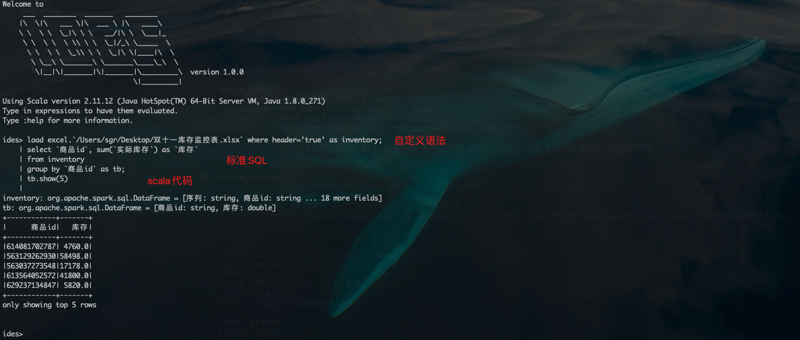

IDES(智能数据探索服务)
---


**IDES**(*from DataLinked*) is an open source project to solve the unified `bigdata + AI` development process. 
In order to simplify the process of `data processing`, `data analysis`, `data mining`, `machine learning`, etc.


## Features
* Load and save various data sources for data exploration (such as ETL)
* Support standard SQL for data processing
* Support native Scala/Spark code execution
* ...

## Building Ides from Source
Prerequisites for building Ides Server:
- Unix-like environment (we use Linux, Mac OS X, Cygwin, WSL)
- Git
- Maven (we recommend version 3.5.4)
- Java 8 or 11 (we recommend version 1.8)

```shell
git clone https://github.com/bebee4java/ides.git
cd ides
./bin/ides-build.sh
```
Now we got the executable distribution package, like this `ides-1.0.0-bin-spark2.4.tgz`.

*NOTE: Maven 3.5.4, java 1.8.0_271 in Mac OS X are tested.*

## Deploy Ides Server
- You can use bin/ides-shell.sh to start a Ides serve after unpack the distribution (tgz) package. 
- We recommend to run it use yarn-client or local mode in spark cluster after packaged jar(can use bin/package.sh).

## Documentation
The documentation of Ides is located on the website: https://www.yuque.com/ides/docs or in the docs/ directory of the source code.
We recommend that you go to the website: https://www.yuque.com/ides for help. We hosted all the documents on the `yuque` platform.

## Fork and Contribute
This is an active open-source project. We are always open to people who want to use the system or contribute to it. 
Contact us if you are looking for implementation tasks that fit your skills.

If you plan to contribute to this repository, we recommend you to create an issue at our [Issue page](https://github.com/bebee4java/ides/issues) first, 
then commit your source code or other topic (e.g., documentation, new idea and proposal).
<br/>
<br/>

<font size="4"><b>Slack</b></font>

You can also join us and become part of our family by slack, to redefine the way we build data + ai pipelines today.
[Join discussion group >>](https://join.slack.com/t/data-linked/shared_invite/zt-1dmksuk35-uiYrpUrWhQHPomqBHLd72w)
